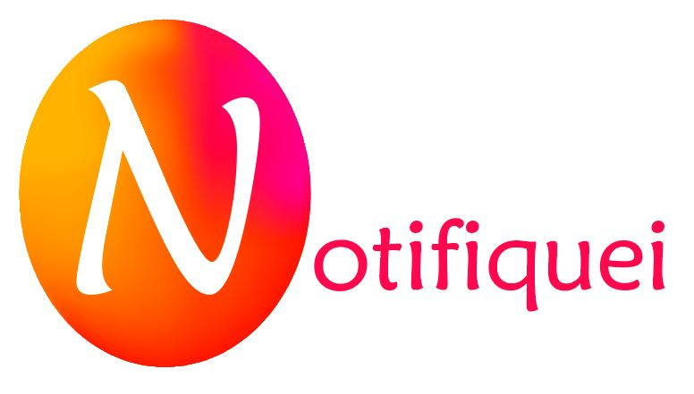

# Landing Page

This is a simple landing page project for an app that I am developing.

It´s called "Notifiquei" and it´s basically a system that allows people living in a residential building or a condominium to receive notifications in their smartphones from packages, orders or stuff like that, that has arrived for them. Also, it offers a service for booking activities in common spaces like the party saloons, gym, pool, barbecue place, game rooms and more. Important alerts like power or water outage, garage cleaning and other maintenance operations will also be received in their phones as well as the schedule information.

The app also offers a community space where pictures can be shared as well comments, complaints, suggestions and other kinds of interactions.

This landing page was made with HTML and CSS. The future work to be done is the app-development for Android and IOS, using ReactJs.

